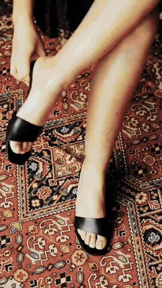

# Reel review #2 — The room begins underfoot

**Open the full Reel with sound:**
https://raw.githubusercontent.com/zarirugs/website/codex/instagram-reel-luxury-cuts/public/marketing/instagram/drafts/reel-02-room-begins-underfoot.mp4

## Creative treatment

An eight-second, carpet-led fashion film. Footwear and rug details cut on the
half-beat for the first 1.5 seconds; wider textile-room and walking shots then
breathe for a full beat. There is no instruction, offer, or on-screen CTA. The
only type is the closing `Z A R I / THE ROOM BEGINS UNDERFOOT.` reveal.

The film is 1080 × 1920 at 30 fps. Its nine cuts land on the 120 BPM score at
0.00, 0.50, 1.00, 1.50, 2.50, 3.50, 4.50, 5.50, and 6.50 seconds.

## Music and rights

- **Track:** ZARI Luxury Pulse 001
- **Excerpt:** the full original eight-second composition
- **Language/style:** instrumental; restrained electronic pulse with sub bass,
  muted percussion, and an airy tonal layer
- **Rights route:** original procedural composition generated by
  `scripts/marketing/build-luxury-reel.mjs`; no third-party samples or commercial
  recording
- **Mix:** stereo AAC, 48 kHz; measured mean -21.5 dB and peak -5.5 dB

## Footage and licence records

All footage is newly licensed from Pexels and recorded in
`marketing/stock-usage.json`. The source IDs are 7390122 (Polina Tankilevitch),
3015514 (Taryn Elliott), and 3064217 (Taryn Elliott). These credits remain in the
review record and do not need to appear in the public caption.

## Review score

| Category | Score | Reason |
| --- | ---: | --- |
| Aesthetic strength | 5/5 | A human detail opens immediately, then scale changes without explanatory copy. |
| Brand relevance | 5/5 | Rugs remain the dominant field in every shot. |
| Authenticity | 4/5 | All imagery is real licensed footage; it is presented as mood rather than a ZARI product claim. |
| Pacing and sound | 5/5 | Nine cuts resolve on beat, with a deliberate shift from rapid detail to a longer reveal. |
| Technical execution | 5/5 | 1080 × 1920, 30 fps, H.264/AAC, safe-zone type, and clearly audible original music. |
| **Total** | **24/25** | Passes the 21/25 gate and all mandatory minimums. |

**Sequence score:** 5/5. The edit moves from fashion detail to spatial context
and returns to the carpet for the final brand hold.

## Caption draft

A room does not begin at the walls. It begins underfoot—where colour, movement,
and memory meet. ZARI.

Comment `APPROVE REEL 2` to approve this cut, or
`REJECT REEL 2 — reason` to request a replacement. Approval does not publish it.
